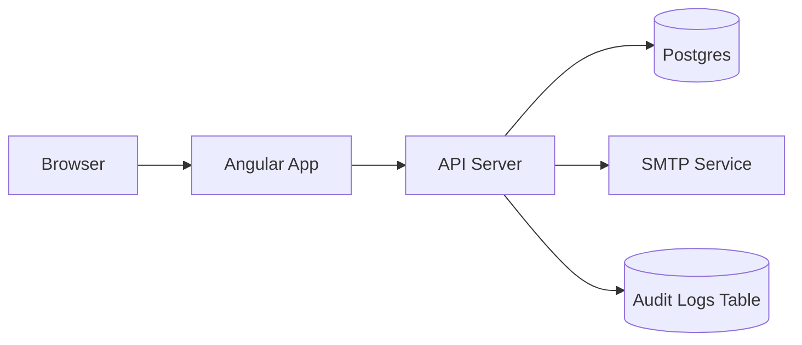
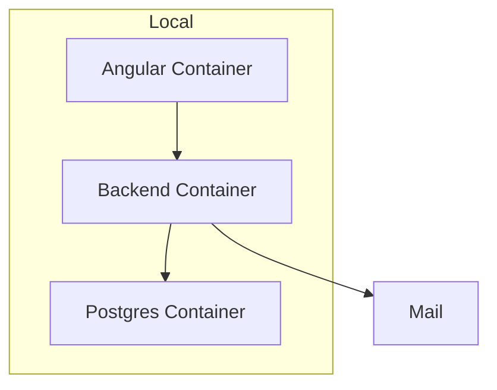
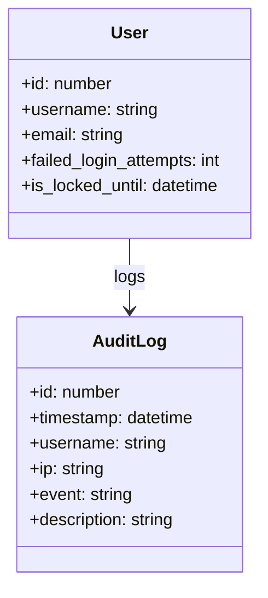

# Recuperación de Contraseña, Auditoría, Docker y Diseño (Resumen técnico)

Fecha: 2025-11-21

Este documento resume los cambios propuestos e implementaciones en el frontend, el contrato API (OpenAPI), y la guía para ajustes en el backend y base de datos. Incluye además instrucciones para contenerizar y desplegar la aplicación frontend.

---

## 1) Flujo de Recuperación de Contraseña (Requerimientos de seguridad)

Flujo del lado del usuario (frontend):

- El usuario ingresa su nombre de usuario en el formulario de `Recuperación de contraseña`.
- El frontend envía una petición POST a `/auth/password-recovery` con `{ username }`.
- Independientemente de que el usuario exista, la respuesta mostrada al cliente es genérica: "Si la cuenta existe, se ha enviado un correo con instrucciones." Esto evita filtrar si un usuario es válido.

Recomendaciones y cambios en backend/DB (no incluidos en este repo):

- Tabla `users`:
  - Agregar columna `is_locked_until TIMESTAMP NULL` para bloqueo temporal.
  - Agregar columna `failed_login_attempts INT DEFAULT 0` para conteo de intentos fallidos.

- Tabla `audit_logs` (nueva):
  - `id BIGSERIAL PRIMARY KEY`
  - `timestamp TIMESTAMP WITH TIME ZONE NOT NULL`
  - `username TEXT NULL`
  - `ip TEXT NULL`
  - `event TEXT NOT NULL` (e.g., 'LOGIN_FAILED', 'PASSWORD_RECOVERY_INVALID_USER')
  - `description TEXT NULL`

- Endpoint `POST /auth/password-recovery`:
  - Si el usuario NO existe: crear un registro en `audit_logs` con `event='PASSWORD_RECOVERY_INVALID_USER'` y `description='Usuario no encontrado'` (no retornar detalle al cliente).
  - Si el usuario existe: generar contraseña temporal (ej: token JWT corto o password aleatoria hash), guardar con expiración o guardar token en tabla `password_recovery_tokens`, y enviar correo con instrucciones.
  - Respuesta: siempre 200 con mensaje genérico.

Ejemplo de SQL (Postgres):

```sql
ALTER TABLE users ADD COLUMN failed_login_attempts INT DEFAULT 0;
ALTER TABLE users ADD COLUMN is_locked_until TIMESTAMP WITH TIME ZONE NULL;

CREATE TABLE audit_logs (
  id BIGSERIAL PRIMARY KEY,
  timestamp TIMESTAMPTZ NOT NULL DEFAULT now(),
  username TEXT,
  ip TEXT,
  event TEXT NOT NULL,
  description TEXT
);

CREATE TABLE password_recovery_tokens (
  id BIGSERIAL PRIMARY KEY,
  user_id BIGINT REFERENCES users(id) ON DELETE CASCADE,
  token TEXT NOT NULL,
  expires_at TIMESTAMPTZ NOT NULL,
  used BOOLEAN DEFAULT false
);
```

## 2) Control de Intentos de Inicio de Sesión

Requisitos implementacionales (backend):

- En el proceso de login, al detectar credenciales inválidas, incrementar `failed_login_attempts`.
- Registrar en `audit_logs` cada intento fallido con `event='LOGIN_FAILED'` y almacenar la IP si está disponible.
- Si `failed_login_attempts >= MAX_FAILED` (configurable, p.e. 3), establecer `is_locked_until = now() + INTERVAL '5 minutes'` y registrar `event='USER_LOCKED'`.
- Al login exitoso: resetear `failed_login_attempts = 0` y `is_locked_until = NULL`.

Parámetros configurables (archivo de configuración):

- `security.maxFailedAttempts = 3`
- `security.lockDurationMinutes = 5`

Evidencia de bloqueo temporal (cómo probar):

1. Intentar 3 logins con contraseña incorrecta para un usuario existente.
2. Consultar `audit_logs` y `users` para ver `LOGIN_FAILED` y `USER_LOCKED`.
3. Intentar login durante el periodo de bloqueo; el backend debe rechazar y devolver 423 Locked o 429 con mensaje genérico.

Ejemplo SQL para incrementar intentos y bloquear:

```sql
-- Pseudocódigo PL/pgSQL
UPDATE users SET failed_login_attempts = failed_login_attempts + 1 WHERE username = $1 RETURNING failed_login_attempts;
IF returned.failed_login_attempts >= 3 THEN
  UPDATE users SET is_locked_until = now() + interval '5 minutes' WHERE username = $1;
  INSERT INTO audit_logs(username, ip, event, description) VALUES($1, $ip, 'USER_LOCKED', 'Bloqueo temporal por intentos fallidos');
END IF;
```

## 3) Documentación y Modelado

Adjunto en este repositorio un archivo OpenAPI básico (`docs/openapi.yaml`) con los endpoints relevantes (`/auth/password-recovery` y `/audit/logs`). Para documentar completamente la API añada anotaciones Swagger en el backend.

Diagramas (Mermaid) - incluir en README o herramienta compatible:

### Diagrama de arquitectura (simplificado)



### Diagrama de despliegue



### Diagrama de clases (simplificado)



Recomendación de estilo de documentación: usar Swagger + comentarios en el backend (JavaDoc / Swagger annotations) y TypeScript Doc en el frontend.

## 4) Contenerización y despliegue

Incluido `Dockerfile` en la raíz que construye la aplicación y la sirve con Nginx.

Comandos para construir y ejecutar:

```powershell
# Construir imagen
docker build -t clinica-frontend:local .

# Ejecutar contenedor, mapeando puerto 4200 local al 80 del contenedor
docker run -d -p 4200:80 --name clinica-frontend clinica-frontend:local

# Ver logs
docker logs -f clinica-frontend

# Parar y eliminar
docker stop clinica-frontend; docker rm clinica-frontend
```

Variables de entorno (si aplica):

- Para la app Angular puedes inyectar `API_URL` en `environment.ts` durante build o usar `ngx-build-plus` para reemplazar variables en tiempo de ejecución.

## 5) Visualización de Logs de Auditoría (Frontend)

Se implementó un componente `AuditLogsComponent` en `src/app/demo/pages/audit` que consume el endpoint `/audit/logs`. Requisitos implementados en frontend:

- Tabla dinámica con filtros por usuario y evento (básico).
- Petición al backend via `AuditService` usando `BackendService` existente.

Para pruebas sin backend activo, el componente puede adaptarse para cargar datos mock en `ngOnInit`.

---

Si desea que implemente también los cambios del backend y las migraciones en este repositorio, necesito acceso al código backend o indicaciones claras del stack (lenguaje, framework). Puedo generar el SQL de migración y un ejemplo de implementación en Node.js/Express o Spring Boot según prefiera.
